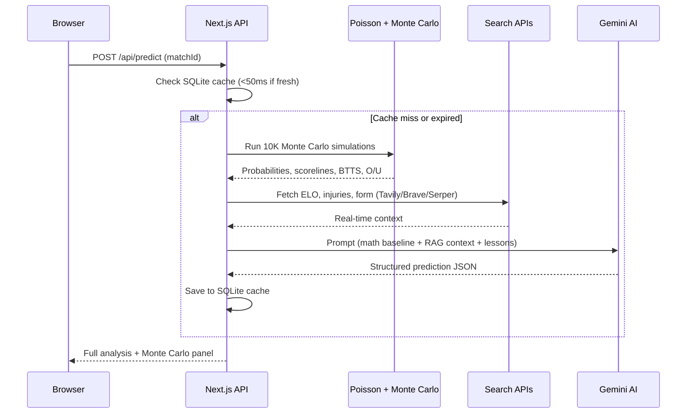

# ⚽ FIFA World Cup 2026 AI Predictor

[](https://nextjs.org/)
[](https://react.dev/)
[](https://tailwindcss.com/)
[](./LICENSE)

An AI-powered football match prediction engine that combines **Poisson modeling**, **Monte Carlo simulations (10,000 iterations)**, and **multi-model LLM consensus** to deliver professional-grade match analysis and betting insights.

> 🇻🇳 [Phiên bản Tiếng Việt](./README.vi.md)

**🔗 [Live Demo](https://football-predict-iota.vercel.app/)**

---

## Screenshots

<p align="center">
  
  <br/>
  <em>Match cards with live scores, AI prediction badges, and quick-actions</em>
</p>

### 2. Hệ Thống RAG Search Đa Nguồn Động
* Tích hợp 3 dịch vụ API tìm kiếm thời gian thực tốt nhất hiện nay:
  * **Tavily Search API** (API chuyên dụng tối ưu cho RAG).
  * **Brave Search API** (API tìm kiếm toàn cầu độc lập chất lượng cao).
  * **Serper Google Search API** (Google Search siêu nhanh).
* **Cơ chế Xoay Vòng & Dự phòng (Rotation & Failover):**
  * Cho phép thêm nhiều API Keys cho mỗi nhà cung cấp.
  * Tự động xoay vòng key khi gặp lỗi hạn mức hoặc lỗi mạng.
  * Tự động chuyển đổi sang nhà cung cấp kế tiếp nếu nhà cung cấp hiện tại lỗi toàn bộ.
  * Tự động fallback về DuckDuckGo Scraper làm dự phòng cuối cùng.

### 3. Trang Quản Trị Cấu Hình Tập Trung (`/admin`)
* Giao diện quản trị cấu hình AI & RAG trực quan.
* Quản lý danh sách AI Models hoạt động, sắp xếp thứ tự ưu tiên bằng nút di chuyển (Up/Down) và bật/tắt linh hoạt.
* Quản lý thứ tự ưu tiên của các Search Engines (Tavily, Brave, Serper) và thêm/xóa/bật/tắt API Keys của từng Engine.
* Toàn bộ cấu hình được lưu trữ bền vững vào **SQLite Database** (`worldcup_predictions.db`), hoàn toàn loại bỏ việc sử dụng biến môi trường cứng trong mã nguồn.

### 4. Tự Động Cập Nhật Kết Quả & Chấm Điểm
* Tự động quét internet để tìm tỉ số, phạt góc, thẻ phạt thực tế của trận đấu sau khi diễn ra.
* Đối chiếu kết quả và chấm điểm (Đúng/Sai/Hòa tiền) cho toàn bộ các kèo dự đoán trước đó.
* Đồng bộ hóa tỉ số trực tuyến ngược vào file dữ liệu cấu trúc [fixtures.json](file:///d:/Projects/Football_Predict/src/data/fixtures.json) và hiển thị trực tiếp lên giao diện trang chủ với các nhãn màu sinh động.

### 5. Hệ Thống Dự Đoán Hybrid Chuyên Sâu (Poisson + AI Consensus)
* **Mô hình Phân phối Poisson:** Tự động tính số bàn thắng kỳ vọng (xG) và xác suất Thắng - Hòa - Thua (1X2) của 2 đội làm baseline định lượng. Áp dụng hệ số lợi thế sân nhà (+0.3 xG) cho 3 nước chủ nhà (Mexico, Canada, USA) khi thi đấu tại nước họ.
* **Consensus Engine (Đồng thuận đa mô hình):** Gửi prompt dự đoán song song đến 2 AI Models hàng đầu đang bật để lấy trung bình cộng xác suất thắng/hòa/thua, tối ưu độ tin cậy.
* **Prompting Nâng Cao:** Sử dụng Few-Shot mẫu nhận định, ép AI suy luận chiến thuật logic chi tiết (Chain of Thought - CoT) trước khi đưa ra kết luận tỷ số.

### 6. Quản Lý Thực Lực 48 Đội Tuyển & Đồng Bộ Stats (AI/Search)
* **Cơ sở dữ liệu Đội tuyển:** Lưu trữ FIFA Rank, ELO Rating, phong độ gần đây, bàn thắng/thua trung bình 10 trận, danh sách ngôi sao, phân tích chiến thuật của 48 đội tuyển World Cup 2026.
* **Chỉnh sửa thủ công (Manual Update):** Tab quản lý đội tuyển trong trang `/admin` cho phép tìm kiếm, lọc theo bảng đấu và chỉnh sửa nhanh chỉ số bằng Modal Glassmorphism.
* **Đồng bộ tự động bằng AI/Search:**
  - Trên trang `/stats`: Panel chọn nhanh đội tuyển và click cập nhật chỉ số bằng AI Gemini + Search RAG.
  - Trên trang chủ: Nút bấm **"⚡ Stats AI"** (dạng Lưới) và **📊** (dạng Danh sách) trên mỗi Card trận đấu để đồng bộ Stats 2 đội song song.

### 7. Siêu Máy Tính Monte Carlo & Caching Thông Minh (SQLite)
* **Mô phỏng Monte Carlo 10,000 lần:** Sử dụng mô hình Poisson chạy giả lập trận đấu 10,000 lần để xác định xác suất 1X2, BTTS, Tài Xỉu 2.5 và top 5 tỷ số khả thi nhất làm đầu vào định lượng cho AI.
* **Cơ chế Caching thông minh:** Tự động lưu trữ dự đoán vào SQLite, tự động tải từ cache (<50ms) nếu trận đấu diễn ra trong vòng 24 giờ và chỉ số đội tuyển chưa đổi, có nút "🔄 Phân tích lại" để ép chạy lại từ đầu.

### 8. Tự Động Quy Đổi & Hiển Thị Giờ Việt Nam (UTC+7)
* **Timezone Converter Helper:** Xây dựng cơ chế tự động phát hiện múi giờ địa phương dựa trên địa điểm thi đấu (`venue`) của 16 sân vận động World Cup 2026 và các trận giao hữu ở châu Âu, quy đổi chuẩn xác sang giờ Việt Nam (UTC+7).
* **Hiển thị song song thông minh:** Thiết kế hiển thị giờ Việt Nam nổi bật làm chủ đạo trên trang chủ (Grid/List) và hiển thị song song giờ VN cùng giờ địa phương tại header chi tiết trận đấu giúp dễ dàng đối chiếu.
* **Đồng bộ Sắp xếp & Hydration Safety:** Sắp xếp danh sách trận đấu trên trang chủ chạy tuyến tính chuẩn xác theo ngày giờ Việt Nam thực tế, đồng thời triệt tiêu hoàn toàn lỗi Hydration Mismatch đặc thù của Next.js SSR.

### 9. Dự Đoán Hiệp 1 & Hiệp 2 (Chuyên Sâu)
* Hỗ trợ dự đoán và phân tích chiến thuật chuyên biệt riêng cho **Hiệp 1 (First Half)** hoặc **Hiệp 2 (Second Half)**.
* Thuật toán Poisson tự động chia nhỏ tỷ lệ Lambda theo từng hiệp đấu (Hiệp 1: góc * 0.47, thẻ * 0.35, lambda * 0.45; Hiệp 2: góc * 0.53, thẻ * 0.65, lambda * 0.55).
* Mô phỏng Monte Carlo Hiệp 2 tự động tích lũy và cộng dồn tỷ số Hiệp 1 thực tế để đảm bảo kết quả giả lập cả trận đồng bộ.
* Chấm điểm cược động và phân tách biểu đồ thống kê hiệu suất (đúng tỷ số & đúng kết quả 1X2) của AI độc lập theo loại dự đoán.

### 10. Xác Thực Người Dùng & Đăng Nhập Google (OAuth2)
* **JWT Cookie Security:** Sử dụng Session Token JWT lưu trữ trong Cookie HttpOnly để đảm bảo an toàn tối đa trước các lỗ hổng XSS/CSRF.
* **Đăng nhập Google thô:** Thiết kế luồng tích hợp Google Login qua endpoint API Redirect thô tối giản mà không cần cài thêm thư viện cồng kềnh.
* **Dev Mode Bypass:** Hỗ trợ cơ chế giả lập OAuth token giúp quá trình kiểm thử tại máy cục bộ (Dev environment) không bị gián đoạn khi thiếu cấu hình Client ID/Secret thực tế.
* **Giao diện Glassmorphism:** Cung cấp trang Đăng nhập (`/login`) và Đăng ký (`/signup`) sang trọng đồng bộ với phong cách chung của ứng dụng.
* **Trang cá nhân & Bảo mật (/account):** Trang quản lý tài khoản hiển thị thông tin chi tiết (tên đăng nhập, email, loại tài khoản, ngày đăng ký) và hỗ trợ đổi mật khẩu cho người dùng cục bộ (local) với cơ chế bảo mật xác nhận mật khẩu cũ và băm hash PBKDF2 an toàn.

### 11. Trợ Lý AI Chatbox Nổi, Link Reader & Đa Đoạn Chat (Multi-Session)
* **Vị trí hiển thị tinh chỉnh:** Đẩy widget chatbox nổi sang góc dưới bên trái màn hình (`bottom-24`) để tránh đè lên nút điều hành API Activity Float.
* **Tích hợp 10 Backend Tools (Function Calling):** Hỗ trợ AI tự động kích hoạt cào kèo nhà cái, tra cứu internet, ELO đội tuyển, chạy dự đoán realtime, cập nhật kết quả, thống kê AI... qua Gemini SDK.
* **Đính kèm & Nén hình ảnh:** Hỗ trợ đính kèm tối đa 10 ảnh trong một tin nhắn chat (tải lên Cloudinary song song), tự động nén Canvas phía client để giảm dung lượng payload.
* **Bộ đọc liên kết thông minh (Link Reader):** Tự động phân tích URL trong ô chat. Link nội bộ (trận đấu) truy vấn nhanh từ DB (<200ms); link ngoài được scrape thô và lọc văn bản sạch làm tài liệu tham khảo cho LLM.
* **Hệ thống đa đoạn chat (Multi-Session Chats):** Lưu lịch sử chat độc lập theo từng session cho cả người dùng đã đăng nhập (lưu bảng `chat_sessions` trên SQLite/Turso) và khách (lưu `sessionStorage`). Có menu sidebar overlay trượt lề trái để quản lý danh sách cuộc trò chuyện.
* **Tự động đặt tên cuộc trò chuyện bằng AI:** Gemini tự động phân tích câu hỏi đầu tiên và đặt tên ngắn gọn dạng Sentence case cho session, trả về qua Server-Sent Events (SSE) để cập nhật UI tức thời.
* **Hệ thống gợi ý câu hỏi tiếp theo (Dynamic Followups):** Client tự động parse thẻ XML `<followups>` từ stream phản hồi của AI để hiển thị 3 nút gợi ý Sentence case tiếp theo.
* **Xử lý hiển thị cao cấp:** Thay thế các popup confirm mặc định bằng SweetAlert2 giao diện tối sang trọng, ép z-index lên `999999` thông qua callback `didOpen` để luôn nổi bật trên Chatbox.
* **An toàn dữ liệu sessionStorage:** Sử dụng các helper `safeGetItem` và `safeJsonParse` bảo vệ client khỏi SyntaxError do dữ liệu sessionStorage rác hoặc `'undefined'`.

---

## Key Features

### 🧠 Hybrid AI Prediction Engine
Combines a **Poisson Expected Goals (xG) baseline** with **multi-model consensus** (running 2 AI models in parallel + a Critic referee) to predict outcomes across 6 betting markets: 1X2, Over/Under, Asian Handicap, BTTS, Corners, and Cards.

### 🔍 Multi-Source RAG Search with Failover
Integrates **Tavily**, **Brave Search**, and **Serper APIs** with automatic key rotation, provider failover, and DuckDuckGo scraping as the final fallback — ensuring real-time data always reaches the AI.

### 🎰 Monte Carlo Supercomputer
Runs **10,000 Poisson simulations** per match to compute win/draw/loss probabilities, BTTS odds, Over/Under 2.5, and the top 5 most likely scorelines. Results are fed directly into the AI prompt as quantitative context.

### 📊 Auto Scoring & Self-Retrospective
After matches conclude, the system automatically fetches real scores from the web, scores all prior predictions, and triggers an AI **Self-Retrospective** to learn from mistakes — storing lessons in the database for future in-context learning.

### 🤖 AI Chat Assistant (10 Backend Tools)
A floating chatbot with **10 function-calling tools** (live odds scraping, internet search, real-time predictions, ELO lookup, team stats, result updates, and more), multi-session history, image upload (1–10 images via Cloudinary), and an intelligent link reader.

### ⚙️ Admin Dashboard
Full control panel for managing AI models (priority ordering, enable/disable), search engine keys, team stats (48 World Cup 2026 teams with manual edit), and a backtesting console with configurable model rotation and cool-down.

---

## Tech Stack

| Layer | Technology |
|-------|-----------|
| **Framework** | Next.js 16 (App Router) |
| **UI** | React 19, Tailwind CSS 4, Glassmorphism design |
| **Database** | SQLite / Turso DB (libSQL over HTTP) |
| **AI Models** | Google Gemini API (multi-model rotation & consensus) |
| **RAG Search** | Tavily, Brave Search, Serper + DuckDuckGo fallback |
| **Image Storage** | Cloudinary (parallel upload, client-side canvas compression) |
| **Auth** | Google OAuth2, JWT HttpOnly cookies, PBKDF2 |

---

## Getting Started

### Prerequisites
- Node.js 18+
- npm or yarn

### Installation

```bash
# 1. Clone the repository
git clone https://github.com/your-username/football-predict.git
cd football-predict

# 2. Install dependencies
npm install

# 3. Set up environment variables
cp .env.example .env.local
# Edit .env.local with your API keys (Gemini, Tavily, Brave, Serper, Cloudinary)

# 4. Run the development server
npm run dev
```

The database (`worldcup_predictions.db`) and 48 team records are auto-created and seeded on first run.

### Available Pages

| Route | Description |
|-------|------------|
| `/` | Match schedule with live scores & AI prediction cards |
| `/stats` | Performance analytics & team stats sync |
| `/admin` | System configuration, model management & backtesting |
| `/login` / `/signup` | Authentication (Google OAuth2 + email) |

---

## Project Structure

### [2026-06-16] - Tích hợp trang cá nhân Tài khoản, đổi mật khẩu và sửa lỗi di động (v1.9.3)
* **Tích hợp trang cá nhân /account**: Phát triển trang cá nhân hiển thị chi tiết (username, email, loại tài khoản, ngày tham gia) và form đổi mật khẩu cho người dùng cục bộ.
* **API đổi mật khẩu**: Viết API POST `/api/auth/change-password` băm mật khẩu PBKDF2 và chặn đổi mật khẩu với tài khoản Google.
* **Đồng bộ điều hướng**: Cập nhật header PC (`UserNav.js`) và footer mobile (`BottomNavigation.js`) để kết nối trang cá nhân.
* **Ẩn header di động**: Ẩn hoàn toàn header thừa trên điện thoại để tối ưu không gian hiển thị.
* **Sửa lỗi lệch chatbox**: Sửa lỗi lệch khung chat sang phải bằng cách đổi cỡ chữ input từ `text-sm` sang `text-base` trên di động để ngăn auto-zoom.

### [2026-06-15] - Tích hợp bộ phân giải Markdown & Bảng biểu dùng chung, nâng cấp prompt nhận định chuyên sâu và kịch bản test model (v1.9.2)
* **Tích hợp bộ phân giải Markdown & Bảng biểu**: Xây dựng module dùng chung `src/lib/markdown.js` để xử lý ký tự `\\n` thô và render bảng biểu Markdown của AI thành bảng HTML Premium trên UI ở cả trang Match và Custom Predictor.
* **Nâng cấp prompt phân tích và an toàn JSON**: Ràng buộc AI phân tích sâu 4-6 câu cho mỗi đội, tối thiểu 5 yếu tố quyết định trận đấu, và bắt buộc escape dấu nháy kép `\"` để bảo vệ tính hợp lệ của JSON.
* **Chuẩn hóa phản biện hai lớp của Consensus Engine**: Bổ sung cấu trúc nhận định sau Critic gồm phần lực lượng/phong độ ngắn gọn và phần phản biện sâu, giúp nội dung sau đồng thuận ổn định và đáng tin cậy hơn.
* **Bộ script kiểm tra Rate Limit và phản hồi model**: Bổ sung các công cụ test model trong `scratch/` tự động bypass SSL/Proxy và lưu báo cáo hiệu năng.
* **Đồng bộ hóa Prompt hệ thống giữa Local và Prod**: Kiểm tra chênh lệch dữ liệu giữa Local SQLite và Turso DB Production. Thực hiện đồng bộ 2 chiều: cập nhật `predict_critic_template` mới nhất lên Prod, đồng bộ các prompt `match_chat_system` và `sync_fixtures_template` từ Prod về Local. Đảm bảo 6/6 prompt khớp nhau 100% trên cả 2 môi trường. Cập nhật file cấu trúc `scripts/migrate.mjs` để đồng bộ prompt mặc định mới nhất tránh bị ghi đè, đồng thời thiết lập `scratch/backup_prompts.mjs` sao lưu dữ liệu prompt về thư mục dự án cục bộ an toàn.

---

## How It Works



---

## Contributing

Contributions are welcome! Please open an issue first to discuss what you'd like to change.

1. Fork the repository
2. Create your feature branch (`git checkout -b feature/amazing-feature`)
3. Commit your changes (`git commit -m 'Add amazing feature'`)
4. Push to the branch (`git push origin feature/amazing-feature`)
5. Open a Pull Request

---

## License

This project is licensed under the **MIT License** — see the [LICENSE](./LICENSE) file for details.

---

## Changelog

See [CHANGELOG.md](./changelog.md) for the full version history.
