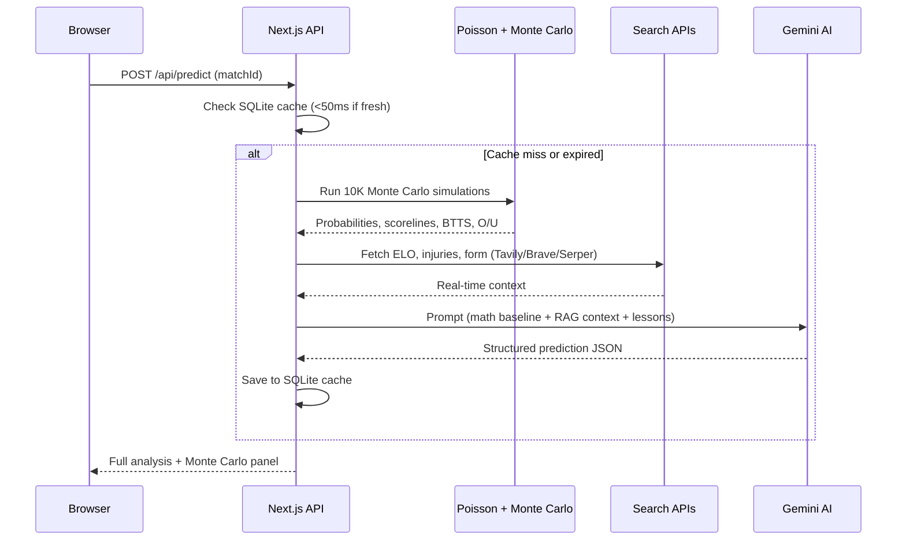

# ⚽ FIFA World Cup 2026 AI Predictor

[](https://nextjs.org/)
[](https://react.dev/)
[](https://tailwindcss.com/)
[](./LICENSE)

An AI-powered football match prediction engine that combines **Poisson modeling**, **Monte Carlo simulations (10,000 iterations)**, and **multi-model LLM consensus** to deliver professional-grade match analysis and betting insights.

> 🇻🇳 [Phiên bản Tiếng Việt](./README.vi.md)

**🔗 [Live Demo](https://football-predict-iota.vercel.app/)**

---

## Screenshots

<p align="center">
  
  <br/>
  <em>Match cards with live scores, AI prediction badges, and quick-actions</em>
</p>

<p align="center">
  
  <br/>
  <em>Detailed match analysis with Monte Carlo simulation panel</em>
</p>

---

## Key Features

### 🧠 Hybrid AI Prediction Engine
Combines a **Poisson Expected Goals (xG) baseline** with **multi-model consensus** (running 2 AI models in parallel + a Critic referee) to predict outcomes across 6 betting markets: 1X2, Over/Under, Asian Handicap, BTTS, Corners, and Cards.

### 🔍 Multi-Source RAG Search with Failover
Integrates **Tavily**, **Brave Search**, and **Serper APIs** with automatic key rotation, provider failover, and DuckDuckGo scraping as the final fallback — ensuring real-time data always reaches the AI.

### 🎰 Monte Carlo Supercomputer
Runs **10,000 Poisson simulations** per match to compute win/draw/loss probabilities, BTTS odds, Over/Under 2.5, and the top 5 most likely scorelines. Results are fed directly into the AI prompt as quantitative context.

### 📊 Auto Scoring & Self-Retrospective
After matches conclude, the system automatically fetches real scores from the web, scores all prior predictions, and triggers an AI **Self-Retrospective** to learn from mistakes — storing lessons in the database for future in-context learning.

### 🤖 AI Chat Assistant (10 Backend Tools)
A floating chatbot with **10 function-calling tools** (live odds scraping, internet search, real-time predictions, ELO lookup, team stats, result updates, and more), multi-session history, image upload (1–10 images via Cloudinary), and an intelligent link reader.

### ⚙️ Admin Dashboard
Full control panel for managing AI models (priority ordering, enable/disable), search engine keys, team stats (48 World Cup 2026 teams with manual edit), and a backtesting console with configurable model rotation and cool-down.

---

## Tech Stack

| Layer | Technology |
|-------|-----------|
| **Framework** | Next.js 16 (App Router) |
| **UI** | React 19, Tailwind CSS 4, Glassmorphism design |
| **Database** | SQLite / Turso DB (libSQL over HTTP) |
| **AI Models** | Google Gemini API (multi-model rotation & consensus) |
| **RAG Search** | Tavily, Brave Search, Serper + DuckDuckGo fallback |
| **Image Storage** | Cloudinary (parallel upload, client-side canvas compression) |
| **Auth** | Google OAuth2, JWT HttpOnly cookies, PBKDF2 |

---

## Getting Started

### Prerequisites
- Node.js 18+
- npm or yarn

### Installation

```bash
# 1. Clone the repository
git clone https://github.com/your-username/football-predict.git
cd football-predict

# 2. Install dependencies
npm install

# 3. Set up environment variables
cp .env.example .env.local
# Edit .env.local with your API keys (Gemini, Tavily, Brave, Serper, Cloudinary)

# 4. Run the development server
npm run dev
```

The database (`worldcup_predictions.db`) and 48 team records are auto-created and seeded on first run.

### Available Pages

| Route | Description |
|-------|------------|
| `/` | Match schedule with live scores & AI prediction cards |
| `/stats` | Performance analytics & team stats sync |
| `/admin` | System configuration, model management & backtesting |
| `/login` / `/signup` | Authentication (Google OAuth2 + email) |

---

## Project Structure

```
football-predict/
├── src/
│   ├── app/                    # Next.js App Router pages & API routes
│   │   ├── api/                # REST API endpoints (predict, results, chat, admin)
│   │   ├── match/[id]/         # Match detail page
│   │   ├── stats/              # Performance analytics page
│   │   ├── admin/              # Admin dashboard
│   │   ├── login/ & signup/    # Authentication pages
│   │   └── custom/             # Custom prediction page
│   ├── components/             # React components (Chatbox, Navbar, Cards, Modals)
│   ├── lib/                    # Core logic (DB, Poisson, Monte Carlo, RAG Search, Auth)
│   └── data/                   # Fixture data (187 matches: WC2026, Euro 2024, EPL, La Liga)
├── scripts/                    # Database migrations & seeding
├── public/                     # Static assets
├── docs/                       # Screenshots for README
├── scratch/                    # Dev/test scripts (git-ignored)
└── worldcup_predictions.db     # SQLite database (git-ignored)
```

---

## How It Works



---

## Contributing

Contributions are welcome! Please open an issue first to discuss what you'd like to change.

1. Fork the repository
2. Create your feature branch (`git checkout -b feature/amazing-feature`)
3. Commit your changes (`git commit -m 'Add amazing feature'`)
4. Push to the branch (`git push origin feature/amazing-feature`)
5. Open a Pull Request

---

## License

This project is licensed under the **MIT License** — see the [LICENSE](./LICENSE) file for details.

---

## Changelog

See [CHANGELOG.md](./changelog.md) for the full version history.
