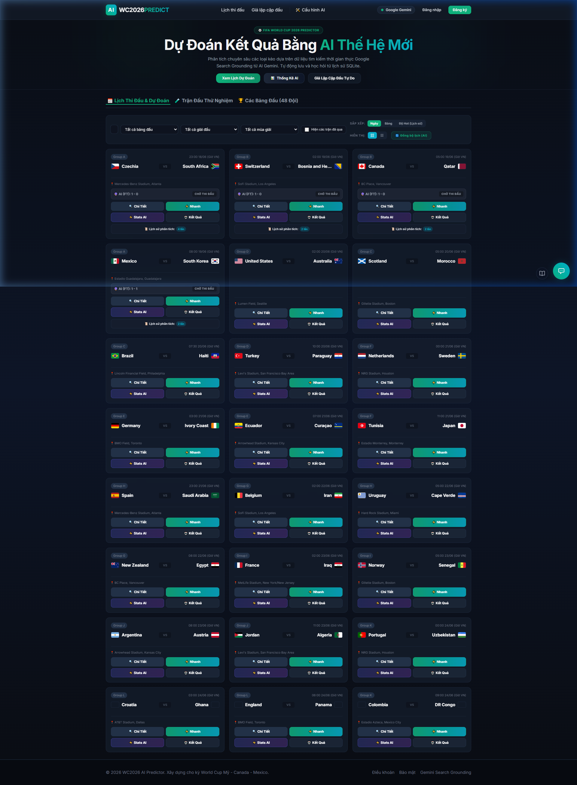
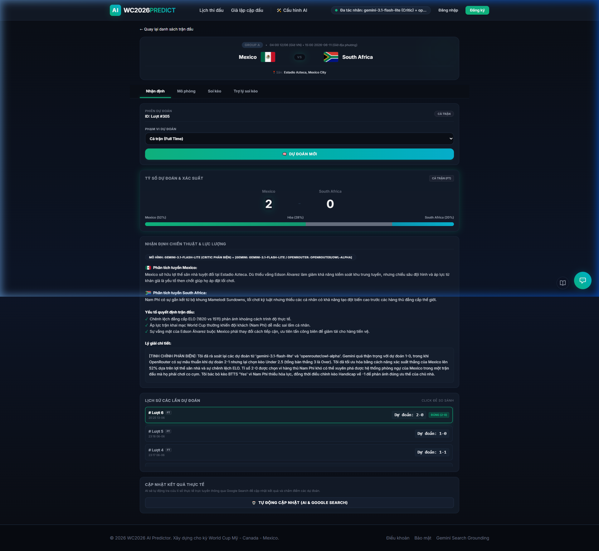
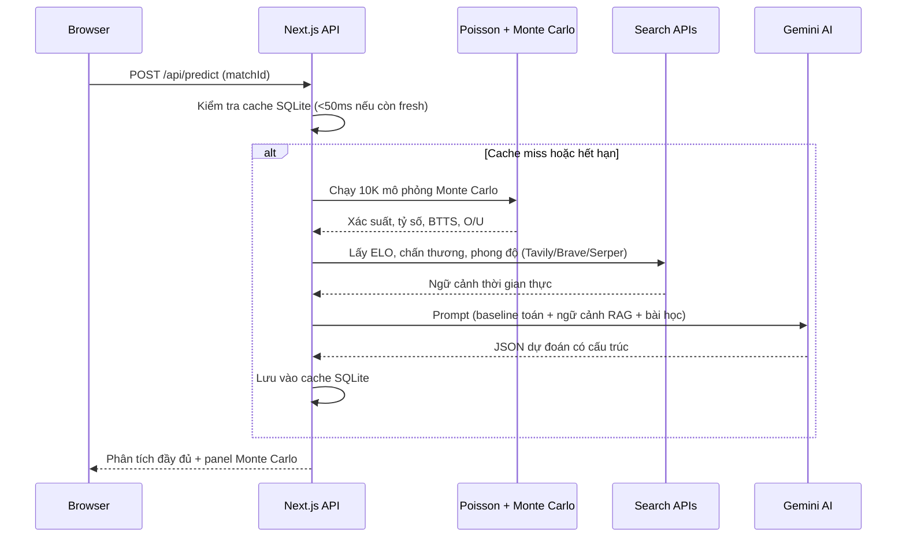

# ⚽ FIFA World Cup 2026 AI Predictor

[](https://nextjs.org/)
[](https://react.dev/)
[](https://tailwindcss.com/)
[](./LICENSE)

Hệ thống dự đoán kết quả bóng đá powered by AI, kết hợp **mô hình Poisson**, **mô phỏng Monte Carlo (10,000 vòng lặp)** và **đồng thuận đa mô hình LLM** để đưa ra phân tích trận đấu và gợi ý kèo chuyên nghiệp.

> 🇬🇧 [English Version](./README.md)

**🔗 [Live Demo](https://football-predict-iota.vercel.app/)**

---

## Screenshots

<p align="center">
  
  <br/>
  <em>Card trận đấu với tỷ số trực tiếp, nhãn AI预测 và nút thao tác nhanh</em>
</p>

<p align="center">
  
  <br/>
  <em>Phân tích chi tiết trận đấu với panel mô phỏng Monte Carlo</em>
</p>

---

## Tính năng chính

### 🧠 Hệ thống dự đoán Hybrid AI
Kết hợp **baseline Poisson Expected Goals (xG)** với **đồng thuận đa mô hình** (chạy song song 2 model AI + Critic trọng tài) để dự đoán kết quả trên 6 loại kèo: 1X2, Tài/Xỉu, Chấp châu Á, BTTS, Phạt góc và Thẻ phạt.

### 🔍 RAG Search đa nguồn với cơ chế Failover
Tích hợp **Tavily**, **Brave Search** và **Serper API** với tự động xoay vòng key, chuyển đổi provider khi lỗi, và DuckDuckGo scraping làm phương án dự phòng cuối cùng — đảm bảo dữ liệu thời gian thực luôn đến được AI.

### 🎰 Siêu máy tính Monte Carlo
Chạy **10,000 mô phỏng Poisson** mỗi trận để tính xác suất thắng/hòa/thua, tỷ lệ BTTS, Tài/Xỉu 2.5 và top 5 tỷ số khả thi nhất. Kết quả được đưa trực tiếp vào prompt AI làm ngữ cảnh định lượng.

### 📊 Tự động chấm cược & Self-Retrospective
Sau khi trận đấu kết thúc, hệ thống tự động lấy tỷ số thực tế từ internet, chấm điểm toàn bộ dự đoán trước đó, và kích hoạt **Self-Retrospective** bằng AI để học từ sai lầm — lưu bài học kinh nghiệm vào database cho lần dự đoán sau.

### 🤖 Trợ lý AI Chatbox (10 Backend Tools)
Chatbox nổi với **10 function-calling tools** (cào kèo nhà cái, tìm kiếm internet, dự đoán realtime, tra cứu ELO, thống kê đội, cập nhật kết quả, v.v.), lịch sử đa session, upload ảnh (1–10 ảnh qua Cloudinary), và bộ đọc liên kết thông minh.

### ⚙️ Bảng điều khiển Admin
Điều khiển toàn diện cho quản lý model AI (sắp xếp ưu tiên, bật/tắt), key search engine, thống kê đội tuyển (48 đội World Cup 2026 với chỉnh sửa thủ công), và backtesting console với model rotation và cool-down cấu hình được.

---

## Công nghệ sử dụng

| Layer | Technology |
|-------|-----------|
| **Framework** | Next.js 16 (App Router) |
| **UI** | React 19, Tailwind CSS 4, thiết kế Glassmorphism |
| **Database** | SQLite / Turso DB (libSQL qua HTTP) |
| **AI Models** | Google Gemini API (xoay vòng đa model & đồng thuận) |
| **RAG Search** | Tavily, Brave Search, Serper + DuckDuckGo fallback |
| **Image Storage** | Cloudinary (upload song song, nén canvas phía client) |
| **Auth** | Google OAuth2, JWT HttpOnly cookies, PBKDF2 |

---

## Hướng dẫn khởi chạy

### Yêu cầu
- Node.js 18+
- npm hoặc yarn

### Cài đặt

```bash
# 1. Clone repository
git clone https://github.com/your-username/football-predict.git
cd football-predict

# 2. Cài đặt dependencies
npm install

# 3. Cấu hình biến môi trường
cp .env.example .env.local
# Chỉnh sửa .env.local với API keys (Gemini, Tavily, Brave, Serper, Cloudinary)

# 4. Chạy development server
npm run dev
```

Database (`worldcup_predictions.db`) và 48 bản ghi đội tuyển sẽ tự động được tạo và seed trong lần chạy đầu tiên.

### Các trang có sẵn

| Route | Mô tả |
|-------|--------|
| `/` | Lịch thi đấu với tỷ số trực tiếp & card dự đoán AI |
| `/stats` | Phân tích hiệu suất & đồng bộ stats đội |
| `/admin` | Cấu hình hệ thống, quản lý model & backtesting |
| `/login` / `/signup` | Xác thực (Google OAuth2 + email) |

---

## Cấu trúc dự án

```
football-predict/
├── src/
│   ├── app/                    # Next.js App Router pages & API routes
│   │   ├── api/                # REST API endpoints (predict, results, chat, admin)
│   │   ├── match/[id]/         # Trang chi tiết trận đấu
│   │   ├── stats/              # Trang phân tích hiệu suất
│   │   ├── admin/              # Bảng điều khiển admin
│   │   ├── login/ & signup/    # Trang xác thực
│   │   └── custom/             # Trang dự đoán tùy chỉnh
│   ├── components/             # React components (Chatbox, Navbar, Cards, Modals)
│   ├── lib/                    # Logic core (DB, Poisson, Monte Carlo, RAG Search, Auth)
│   └── data/                   # Dữ liệu fixtures (187 trận: WC2026, Euro 2024, EPL, La Liga)
├── scripts/                    # Database migrations & seeding
├── public/                     # Static assets
├── docs/                       # Screenshots cho README
├── scratch/                    # Dev/test scripts (git-ignored)
└── worldcup_predictions.db     # SQLite database (git-ignored)
```

---

## Cách hệ thống hoạt động



---

## Đóng góp

Đóng góp luôn được chào đón! Vui lòng mở issue trước để thảo luận về những gì bạn muốn thay đổi.

1. Fork repository
2. Tạo branch tính năng (`git checkout -b feature/amazing-feature`)
3. Commit thay đổi (`git commit -m 'Add amazing feature'`)
4. Push lên branch (`git push origin feature/amazing-feature`)
5. Mở Pull Request

---

## Giấy phép

Dự án này được cấp phép theo **MIT License** — xem file [LICENSE](./LICENSE) để biết chi tiết.

---

## Nhật ký thay đổi

Xem [CHANGELOG.md](./changelog.md) để biết lịch sử phiên bản đầy đủ.
